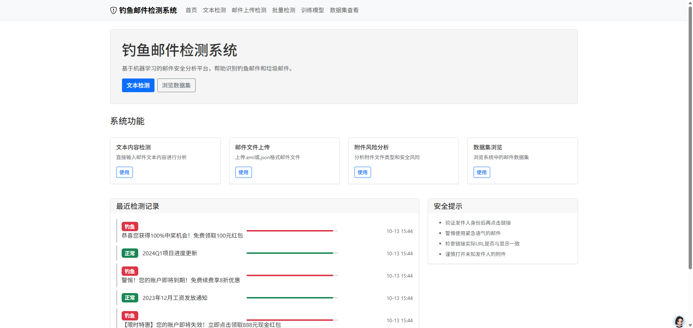
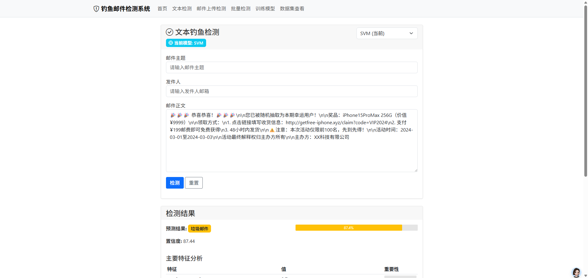
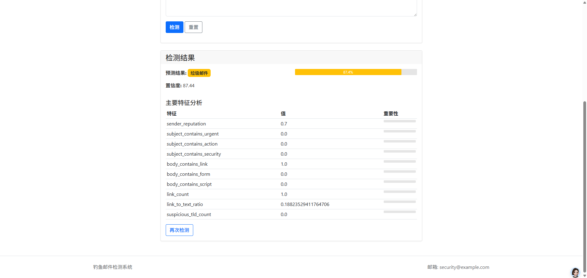
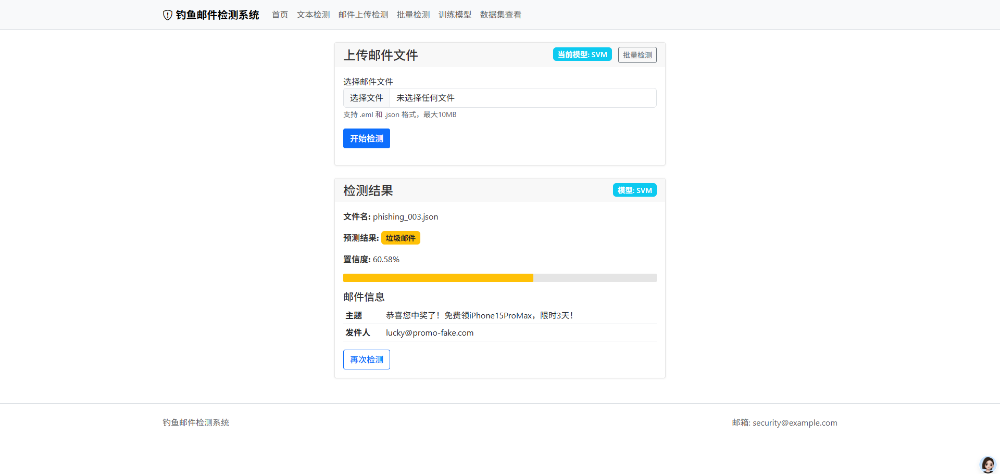
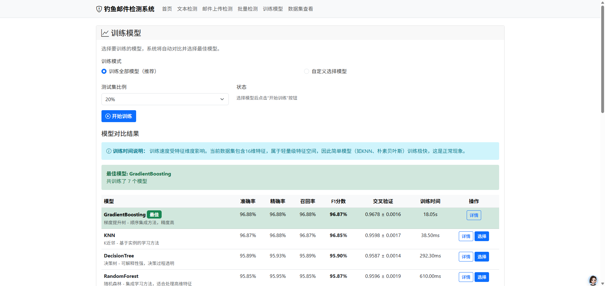
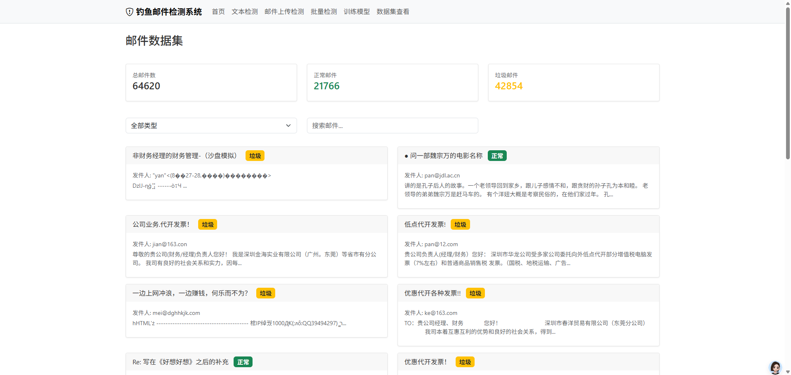

# 钓鱼邮件智能检测系统
# 代码获取：https://mbd.pub/o/bread/YZWcm5dxbQ==

<p align="center">
  
  
  
  
</p>

<p align="center">
  <b>基于机器学习的钓鱼邮件检测与分类系统</b><br>
  <i>Intelligent Phishing Email Detection System Based on Machine Learning</i>
</p>

---

## 📸 系统截图

<table>
  <tr>
    <td align="center">
      
      <br/>
      <sub>🏠 系统首页 - 统计概览与最近检测记录</sub>
    </td>
    <td align="center">
      
      <br/>
      <sub>📝 文本检测 - 实时输入邮件内容分析</sub>
    </td>
  </tr>
  <tr>
    <td align="center">
      
      <br/>
      <sub>🔍 检测结果 - 详细分析与特征重要性</sub>
    </td>
    <td align="center">
      
      <br/>
      <sub>📤 单邮件检测 - 支持 .eml 和 .json 格式</sub>
    </td>
  </tr>
  <tr>
    <td align="center">
      
      <br/>
      <sub>🤖 模型训练 - 多模型对比与选择</sub>
    </td>
    <td align="center">
      
      <br/>
      <sub>📊 数据集查看 - TREC06C数据集浏览</sub>
    </td>
  </tr>
</table>

---

## 📋 项目简介

本项目是一个基于机器学习的钓鱼邮件智能检测系统，采用多种机器学习算法对邮件进行分类，能够有效识别正常邮件、垃圾邮件和钓鱼邮件。系统提供Web界面和API接口，支持单邮件检测、批量检测、附件风险分析等功能。

### 核心功能

- 🔍 **智能邮件检测** - 基于随机森林等多种机器学习算法进行邮件分类
- 📁 **多格式支持** - 支持 `.eml` 和 `.json` 格式的邮件文件
- 🖥️ **Web管理界面** - 基于Flask的直观Web界面
- 📊 **多模型对比** - 支持多种机器学习模型的训练和对比
- 📈 **数据统计分析** - 提供详细的检测统计和可视化报告
- 🔒 **附件风险分析** - 自动分析附件文件的安全风险等级
- 📝 **文本检测** - 支持直接输入邮件文本进行实时检测
- 📦 **批量处理** - 支持批量上传和检测多个邮件文件

---

## 🚀 快速开始

### 环境要求

- Python 3.8+
- pip 包管理器
- 2GB+ 可用内存

### 安装步骤

1. **克隆项目**
```bash
git clone https://github.com/yourusername/phishing-email-detector.git
cd phishing-email-detector/phishing_email_detector
```

2. **安装依赖**
```bash
pip install -r requirements.txt
```

3. **运行应用**
```bash
python app.py
```

4. **访问系统**
打开浏览器访问 `http://localhost:5000`

---

## 📁 项目结构

```
phishing_email_detector/
├── app.py                      # Flask应用主入口
├── config.py                   # 系统配置文件
├── requirements.txt            # Python依赖包
├── models/                     # 模型相关模块
│   ├── phishing_model.py       # 钓鱼邮件检测模型
│   ├── feature_extractor.py    # 特征提取器
│   ├── database.py             # 数据库管理
│   ├── trec06c_processor.py    # TREC06C数据集处理器
│   ├── model_comparison.py     # 多模型对比
│   └── email_parser.py         # 邮件解析器
├── utils/                      # 工具模块
│   ├── logger.py               # 日志管理
│   ├── data_processor.py       # 数据处理
│   └── feature_extractor.py    # 特征提取工具
├── templates/                  # HTML模板
│   ├── index.html              # 首页
│   ├── upload.html             # 单文件上传
│   ├── batch_upload.html       # 批量上传
│   ├── text_detection.html     # 文本检测
│   ├── train_model.html        # 模型训练
│   ├── dataset_view.html       # 数据集查看
│   └── attachment_analysis.html # 附件分析
├── static/                     # 静态资源
│   ├── css/
│   ├── js/
│   └── images/
├── logs/                       # 日志文件
└── models_saved/               # 保存的模型文件
```

---

## 🔧 技术栈

### 后端框架
- **Flask** - Web应用框架
- **SQLite** - 轻量级数据库

### 机器学习
- **scikit-learn** - 机器学习库
  - Random Forest (随机森林)
  - SVM (支持向量机)
  - Logistic Regression (逻辑回归)
  - Naive Bayes (朴素贝叶斯)
  - XGBoost
- **NumPy/Pandas** - 数据处理
- **NLTK/jieba** - 自然语言处理

### 前端技术
- **HTML5/CSS3/JavaScript**
- **Bootstrap** - UI框架
- **Chart.js** - 数据可视化
- **ECharts** - 图表库

### 其他工具
- **BeautifulSoup** - HTML解析
- **email-validator** - 邮件验证
- **wordcloud** - 词云生成

---

## 📊 支持的机器学习模型

系统支持以下机器学习算法进行邮件分类：

| 模型 | 算法类型 | 特点 |
|------|----------|------|
| Random Forest | 集成学习 | 高精度，特征重要性分析 |
| SVM | 监督学习 | 高维数据处理能力强 |
| Logistic Regression | 线性模型 | 快速，可解释性强 |
| Naive Bayes | 概率模型 | 训练速度快，适合大数据集 |
| XGBoost | 梯度提升 | 高精度，防止过拟合 |

---

## 🎯 特征提取

系统从邮件中提取以下类型的特征：

### 文本特征
- 邮件主题长度、关键词数量
- 正文长度、词汇多样性
- 敏感词出现频率
- 文本熵值

### 结构特征
- HTML标签数量
- 链接数量和类型
- 附件数量和类型
- 编码方式

### 元数据特征
- 发件人域名信誉
- 发送时间特征
- 邮件头信息

---

## 📖 使用指南

### 1. 单邮件检测

上传 `.eml` 或 `.json` 格式的邮件文件，系统将自动分析并给出检测结果。

### 2. 批量检测

支持同时上传多个邮件文件进行批量检测，生成汇总报告。

### 3. 文本检测

直接输入邮件主题和正文内容，实时获取检测结果。

### 4. 模型训练

- 使用TREC06C数据集训练模型
- 支持多模型对比训练
- 自动选择最佳模型

### 5. 附件风险分析

上传附件文件，系统将根据文件类型评估风险等级：
- 🔴 **高危** - 可执行文件 (.exe, .bat, .js等)
- 🟡 **中危** - Office文档 (.doc, .xls等)
- 🟢 **低危** - 普通文档 (.pdf, .txt等)

---

## 🔌 API接口

系统提供RESTful API接口：

### 邮件分析
```http
POST /api/analyze
Content-Type: application/json

{
  "sender": "sender@example.com",
  "subject": "邮件主题",
  "body": "邮件正文内容",
  "links": ["http://example.com"],
  "attachments": ["file.exe"]
}
```

### 文本检测
```http
POST /api/text-detection
Content-Type: application/json

{
  "text": "需要检测的邮件文本内容",
  "subject": "邮件主题"
}
```

### 模型训练
```http
POST /api/train
Content-Type: application/json

{
  "models": ["random_forest", "svm"],
  "test_size": 0.2
}
```

---

## 📈 数据集

本项目使用 **TREC06C** 公开数据集进行模型训练：

- **数据集来源**: TREC 2006 Spam Track
- **邮件数量**: 约37,000封
- **语言**: 中英文混合
- **标签**: 正常邮件(ham) / 垃圾邮件(spam)

数据集位于 `trec06c/` 目录下，包含多个子文件夹按类别组织邮件文件。

---

## ⚙️ 配置说明

在 `config.py` 中可以修改以下配置：

```python
# 应用配置
DEBUG = True                    # 调试模式
HOST = '0.0.0.0'               # 监听地址
PORT = 5000                     # 端口号

# 数据库配置
DATABASE_PATH = 'phishing_emails.db'

# 模型配置
MODEL_PATH = 'models/phishing_model.pkl'

# 训练参数
DEFAULT_TEST_SIZE = 0.2         # 测试集比例
DEFAULT_N_ESTIMATORS = 100      # 随机森林树数量
```

---

## 🧪 测试

运行测试脚本验证系统功能：

```bash
# 测试模型
python test_models_direct.py

# 测试数据处理器
python test_data.py

# 测试完整系统
python test_system.py
```

---

## 📊 性能指标

在TREC06C数据集上的典型性能表现：

| 指标 | 数值 |
|------|------|
| 准确率 (Accuracy) | 95%+ |
| 精确率 (Precision) | 94%+ |
| 召回率 (Recall) | 93%+ |
| F1分数 | 93%+ |

*注：实际性能取决于训练数据和模型参数*


